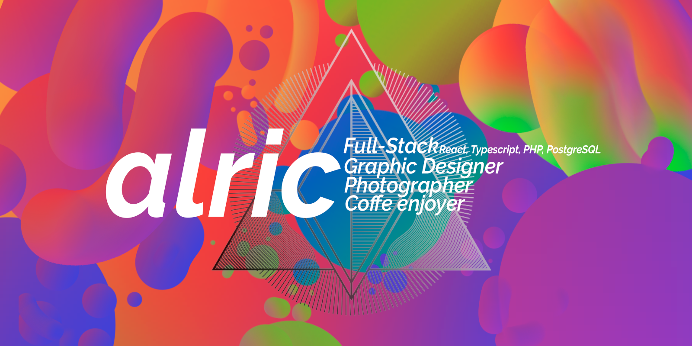

## **Hi! I'm Alric! 👋✨**

 
 

## About Me 🤓

Hey! I'm Alric! I am 19 years old and I'm a brazilian full-stack developer that is learning a lot of stuff right now. Besides coding, I really enjoy playing video-games and listening to music! 
 
 
## Social Media 👤
These are my social media! Make sure to follow me if you don't wanna miss anything about me! I do use my Instagram a lot ;)

[][LinkedIn]
[][Instagram]
[][Twitter]
 
 
## Languages and Tools 💻
These are the languages and tools that I'm using or learning how to use ;)

[][VSCode]
[][IntelliJ]
[][HTML5]
[][CSS3]
[][Bootstrap]
[][Tailwind]
[][JavaScript]
[][TypeScript]
[][React]
[][Python]
[][PhP]
[][Laravel]
[][Java]
[][Spring]
[][Flutter]
[][Angular]
[][Docker]
[][Kubernetes]
[][Git]
[][GitHub]
[][Terminal]
[][Windows]
[][Linux]
[][PostgreSQL]
[][MySQL]
[][Figma]
[][Photoshop]
[][Illustrator] 
 
 
## Some extra stuff about me! ✨
📖 I'm currently learning Java and Spring Framework!
 
📑 I'm planning on beginning to learn game development.
 
📆 My birthday is August 11!
 
✨ My real name is Alec.
 
🎶 My favourite genre of music is hard-rock and heavy metal. But I do enjoy all kind of music! Mainly indie, EDM and MPB (Popular Brazilian Music).
 
🎨 I love to draw and I really enjoy doing graphic design. I use Photoshop all the time, even for silly things!
 
📸 I really enjoy photography!
 👓 I am severely nearsighted, so I have to use glasses all the time!
 
🎮 My favorite game genre is RPG, and my favorite game is Risk of Rain 2.
 
🎬 My favorite movie is Interstellar!
 
📺 My favorite anime is Fullmetal Alchemist: Brotherhood, and my favorite TV-show is Stranger Things.
 
🎸 I really enjoy writing, composing and listening to music! I mainly play electric and acoustic guitar.

## 🌌 Welp, that's who I am! Thanks for being here and have fun coding!

[LinkedIn]: https://www.linkedin.com/in/imalric/
[Instagram]: https://www.instagram.com/alec_o_alric/
[Twitter]: https://twitter.com/thealric/
[VSCode]: https://code.visualstudio.com/
[HTML5]: https://www.w3schools.com/html/
[CSS3]: https://www.w3schools.com/css/default.asp
[JavaScript]: https://www.w3schools.com/js/default.asp
[TypeScript]: https://www.typescriptlang.org/
[React]: https://pt-br.reactjs.org/
[Python]: https://www.python.org/
[PhP]: https://www.php.net/
[GitHub]: https://github.com/
[Git]: https://git-scm.com/
[Windows]: https://www.microsoft.com/pt-br/windows/
[Terminal]: https://pt.wikipedia.org/wiki/Cmd.exe
[PostgreSQL]: https://www.postgresql.org/
[MySQL]: https://www.mysql.com/
[Figma]: https://www.figma.com/
[Photoshop]: https://www.adobe.com/br/products/photoshop.html
[Illustrator]: https://www.adobe.com/br/products/illustrator.html
[Laravel]: https://www.laravel.com/
[Bootstrap]: https://www.getbootstrap.com/
[Java]:https://www.java.com/pt-BR/
[Spring]:https://spring.io/
[IntelliJ]:https://www.jetbrains.com/pt-br/idea/
[Flutter]:https://flutter.dev/
[Angular]:https://angular.io/
[Docker]:https://www.docker.com/
[Kubernetes]:https://kubernetes.io/pt-br/
[Linux]:https://www.linux.org/
[Tailwind]:https://tailwindcss.com/
